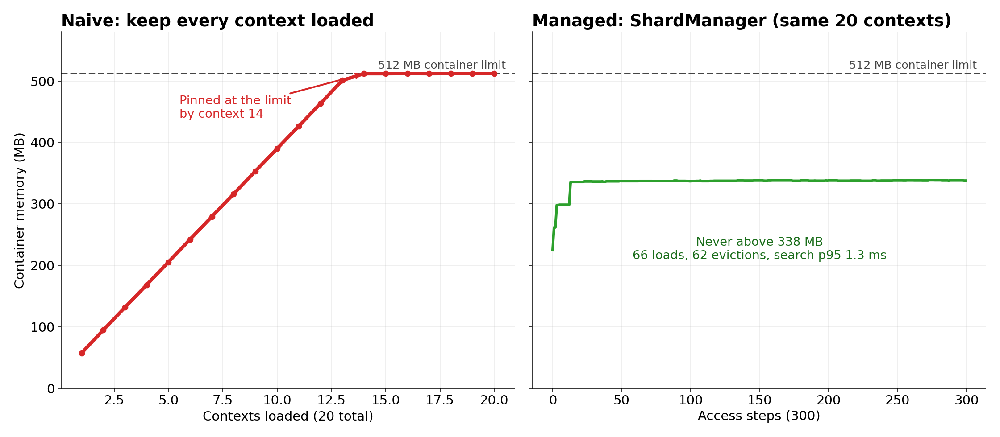
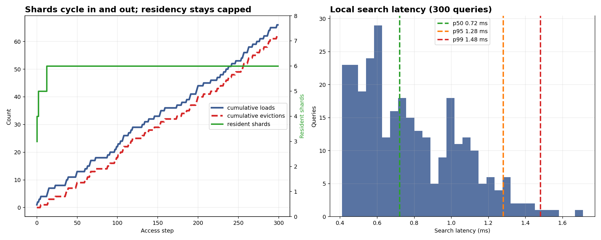
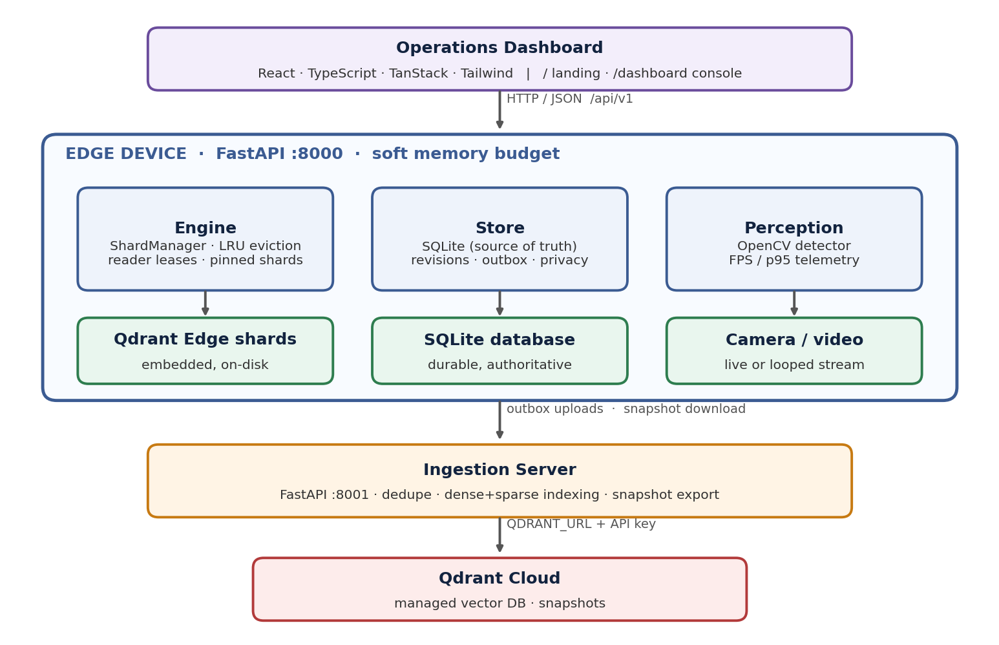
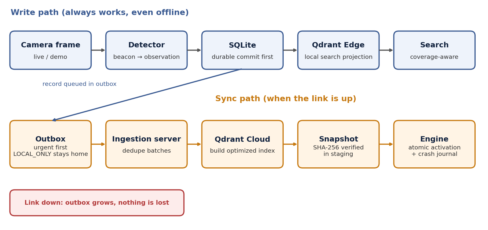

# LIFELINE

**Offline-first edge memory and vector retrieval for devices that can't afford to remember everything.**

LIFELINE lets an inspection robot or rugged handheld keep perceiving, remembering and searching under a hard RAM ceiling and an unreliable network, then synchronise safely when the link returns.

<p align="center">
  
</p>

> Same 20 contexts, same 512 MB container. Loading everything pins memory at the limit by context 14. The `ShardManager` cycles shards in and out and holds steady at about 335 MB.

---

## Contents

1. [The problem](#the-problem)
2. [The solution](#the-solution)
3. [Results](#results)
4. [Architecture](#architecture)
5. [How it works](#how-it-works)
6. [Quickstart](#quickstart)
7. [Demo mode and honest limitations](#demo-mode-and-honest-limitations)
8. [API reference](#api-reference)
9. [Repository layout](#repository-layout)
10. [Testing and validation](#testing-and-validation)
11. [Roadmap](#roadmap)
12. [License](#license)

---

## The problem

An inspection robot in a mine, on an offshore platform or on an industrial site has to:

- run a live perception model **without dropping frames**,
- keep recording observations while **disconnected**,
- search past procedures and observations with **low latency**,
- and do all of it inside a **fixed memory budget**.

A vector index that is simply loaded into RAM grows until the process is at, or killed by, the hardware limit. When the network drops, a naive sync layer either loses data or overwrites it silently.

## The solution

LIFELINE treats device memory as **a resource that must be actively managed**, not a smaller copy of the cloud.

| Idea | What it means |
|---|---|
| **Memory-budgeted shards** | Context (procedures, zones, local observations) is split into shards. A `ShardManager` keeps only what fits in a soft memory budget. |
| **Tiers of importance** | Emergency protocols are pinned and never evicted. Zone shards load on demand and evict by LRU. Local observations live in a non-evictable write shard. |
| **SQLite is the truth** | Every write is committed to SQLite before it is projected into the vector shard, so the search index can always be rebuilt. |
| **Local first, sync later** | The device keeps perceiving, storing and searching offline. An outbox uploads when the link returns. |
| **Index offload** | The edge stores fresh vectors without building an optimised index. The server builds it in Qdrant Cloud and returns a verified snapshot. |
| **Honest retrieval** | Every search reports which shards were searched, which are queued, and which are unavailable offline. |

## Results

The naive-versus-managed experiment (`naive_log.csv`, `managed_log.csv`) used the same 20 contexts under a 512 MB container limit.

| | Naive (load everything) | Managed (`ShardManager`) |
|---|---|---|
| Cost per context | about 37 MB | about 37 MB, but only 6 resident at a time |
| Container memory | Reaches 512 MB by context 14 and stays pinned there | 225 to 338 MB; about 335 MB steady state |
| Contexts served | 20 loaded | All 20, over 300 access steps |
| Shard churn | none (no eviction) | 66 loads, 62 evictions |
| Local search latency | not measured | p50 0.72 ms, p95 1.28 ms, p99 1.48 ms |
| Cold shard load | 440 to 730 ms | about 530 ms average |

<p align="center">
  
</p>

Notes on reading these numbers:

- They come from a Docker-constrained simulation with small shards, not from robot hardware.
- The first search after a zone switch may wait for a cold shard load. Search coverage reports such shards as `queued`.
- In this run the soft budget held about six shards at a time.

The full 12-experiment write-up is in the [Architecture Validation Report](docs/VALIDATION_REPORT.md).

## Architecture

<p align="center">
  
</p>

LIFELINE has three tiers:

1. **Edge device** (FastAPI, port 8000): the Engine (`ShardManager`, leases, eviction), the Store (SQLite, revisions, outbox, privacy) and the Detector (OpenCV, telemetry).
2. **Ingestion server** (FastAPI, port 8001): deduplicates uploads, indexes them in Qdrant Cloud, and exports shard snapshots.
3. **Operations dashboard** (React and TypeScript): live topology, perception, memory search, shard inventory, outbox, conflicts and network fault drills.

## How it works

<p align="center">
  
</p>

### Edge engine and resource control (`engine/`)

- **Bounded working set.** A soft memory cap is enforced by `engine/monitor.py`, which reads the Linux cgroup v2 limit and falls back to process RSS.
- **Deterministic LRU eviction** with cooldown and hysteresis to prevent load and evict thrashing.
- **Reader leases** (`lease_shard`) so a running query never loses its shard mid-operation.
- **Shard roles:** `local_write` (mutable, never evicted), pinned `emergency_protocols`, and on-demand zone shards such as `zone_01` and `zone_02`.
- **Post-load measurement.** A shard's real cost is measured after loading, and it is closed if it does not fit.

### Durable memory and sync (`memory/`, `sync/`)

- **SQLite authority.** Every write, revision and tombstone is committed to SQLite first.
- **Conflict tracking.** Competing edits made during a partition are preserved and surfaced for an operator to resolve, never silently overwritten.
- **Privacy.** Records marked `LOCAL_ONLY` never leave the device.
- **Urgent-first outbox.** Hazard and emergency records upload ahead of routine telemetry.
- **Atomic snapshot activation.** Snapshots download into staging, are verified by SHA-256, then handed to the Engine, with a durable journal for crash rollback.

### Perception and telemetry (`perception/`, `app/telemetry.py`)

- A bounded background OpenCV detector runs without blocking search.
- A thread-safe telemetry hub reports FPS, p50/p95/p99 latency, dropped frames and queue depth.
- Synthetic and live observations are clearly labelled.

### Operations console (`frontend/`)

React 19, TypeScript, TanStack Router and Start, Tailwind CSS, Lucide and Radix UI. Routes: landing page at `/` and the console at `/dashboard`.

## Quickstart

**Prerequisites:** Python 3.10 to 3.14, Node.js 20 or newer.

### 1. Configure

```bash
cp .env.example .env
```

Fill in your own Qdrant Cloud details. Never commit real keys.

```env
QDRANT_URL=https://<your-cluster>.cloud.qdrant.io
QDRANT_API_KEY=<your-api-key>
LIFELINE_DEMO=1
```

### 2. Install

```bash
pip install -r requirements.txt
cd frontend && npm install && cd ..
```

### 3. Run

One command:

```bash
# Windows
.\dev.bat

# Any platform
python run_fullstack.py --dev
```

Or in separate terminals:

```bash
# Edge backend
python -m uvicorn app.main:app --host 0.0.0.0 --port 8000

# Ingestion server
python -m uvicorn server.server:app --host 0.0.0.0 --port 8001

# Frontend dev server
cd frontend && npm run dev
```

| Service | URL |
|---|---|
| Operations dashboard | http://localhost:8000/dashboard |
| Landing page | http://localhost:8000/ |
| Vite dev server (hot reload) | http://localhost:5173/dashboard |
| Edge API explorer | http://localhost:8000/docs |
| Ingestion health | http://localhost:8001/health |

A `Dockerfile` and `compose.yaml` are included for containerised runs.

### Suggested demo walkthrough

1. Call `POST /api/v1/demo/seed` to load demo zones and procedure cards.
2. Hold the red beacon in front of the camera and watch an observation appear.
3. Search memory and read the coverage breakdown.
4. Switch zones and watch a shard evict while `emergency_protocols` stays pinned.
5. Turn on the network fault, trigger more detections, and watch the outbox grow.
6. Turn the fault off, trigger a sync, and watch the queue drain.

## Demo mode and honest limitations

- The implemented live detector is an **OpenCV red-beacon detector**. It is a controlled workload for demonstrating the full pipeline, not an industrial hazard recogniser. LIFELINE does not claim to detect people, fire, structural damage or arbitrary objects.
- Fixture and synthetic data are labelled as such in the API and dashboard.
- Benchmarks were run in Docker-constrained simulation, not on robot hardware.
- Hosted demos have no physical camera, so they use a looped or synthetic stream.

## API reference

### Edge API (`:8000/api/v1`)

| Method | Endpoint | Description |
|---|---|---|
| GET | `/engine/status` | Working-set memory, budget, active leases, loaded shards |
| GET | `/shards` | Registered shards and residency state |
| GET | `/events?limit=30` | Recent events and resident shard inventory |
| POST | `/search/text` | Hybrid search over local contexts and emergency protocols, with coverage |
| POST | `/records` | Commit an observation to SQLite and project it into search |
| GET | `/records/{id}` | Current authoritative revision |
| DELETE | `/records/{id}` | Write a durable tombstone |
| GET | `/sync/status` | Outbox counts, urgent queue, local-only counts |
| POST | `/sync/trigger` | Process an outbox batch immediately |
| GET | `/conflicts` | Contested revisions with review metadata |
| POST | `/conflicts/resolve` | Resolve competing operations with a superseding record |
| POST | `/snapshots/fetch` | Download, verify and activate a server snapshot |
| GET | `/telemetry/detector` | Detector identity, FPS, p95 latency |
| GET | `/perception/status` | Frame counter, drop rate, queue depth, latest observation |
| GET | `/perception/frame` | Latest processed JPEG (synthetic fallback if none) |
| POST | `/network/offline` | Simulate a link outage (`{"offline": true}`) |
| GET | `/network/status` | Link state and fault-injection flag |
| POST | `/demo/seed` | Seed demo records and procedure cards |

### Ingestion server (`:8001/api/v1`)

| Method | Endpoint | Description |
|---|---|---|
| POST | `/ingest` | Ingest and deduplicate outbox batches |
| POST | `/snapshots/prepare` | Index in Qdrant Cloud and export a shard snapshot |
| GET | `/snapshots/latest/{context_id}` | Metadata for the latest snapshot |
| GET | `/snapshots/download/{snapshot_id}` | Stream a prepared snapshot |
| GET | `/health` | Service and Qdrant Cloud connectivity |

## Repository layout

| Path | Purpose |
|---|---|
| `app/` | Edge FastAPI application and telemetry |
| `engine/` | `ShardManager`, memory monitor, leases, eviction |
| `memory/` | SQLite store, revisions, tombstones, conflicts |
| `sync/` | Outbox worker and snapshot activation |
| `perception/` | OpenCV detector and runner |
| `server/` | Ingestion server |
| `shared/` | Code shared by edge and server |
| `frontend/` | React operations console |
| `fixtures/` | Demo and test data |
| `tests/` | Backend test suite |
| `docs/` | Validation report and images |
| `benchmark/`, `edge/`, `dashboard/` | Supporting prototypes and benchmarks |
| `exp2_budget.py`, `naive_log.csv`, `managed_log.csv` | Naive-versus-managed memory experiment |
| `Dockerfile`, `compose.yaml` | Container setup |

## Testing and validation

```bash
# Backend tests
python -m pytest -v

# Production frontend build
cd frontend && npm run build
```

The suite covers the Qdrant Edge adapter, resource-monitor accounting, shard leasing, crash recovery, outbox sync and the public API contract. See the [Architecture Validation Report](docs/VALIDATION_REPORT.md) for the 12 experiments, including behaviour under a hard 512 MB Docker limit.

## Roadmap

- Replace the beacon detector with heavier perception models (object, PPE, anomaly, equipment inspection).
- Let several AI workloads share the same constrained device while the manager decides which memory contexts stay resident.
- Smarter shard prefetching based on where the robot is heading.
- Richer multimodal memory and stronger hybrid retrieval.
- More adaptive sync policies for intermittent connectivity.

## License

Internal inspection robotics software. All rights reserved.
